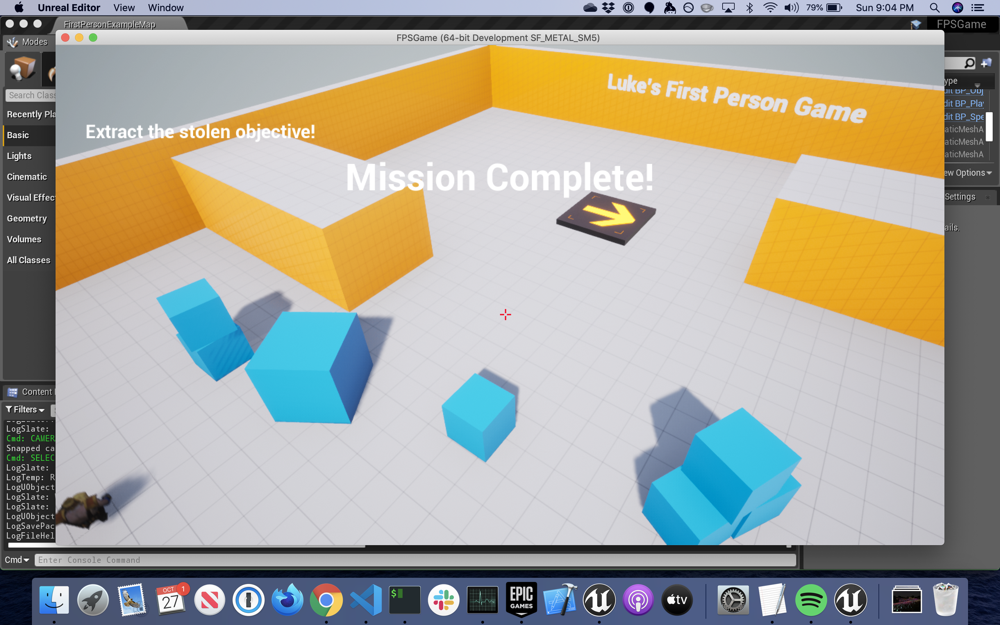

# Stealth Game
This is a game created as part of the Udemy course [Unreal Engine 4 Mastery: Create Multiplayer Games with C++](https://www.udemy.com/unrealengine-cpp/) by Tom Looman.

To complete it you must capture an objective and carry it to the extraction zone without being seen or heard by the patrolling AI guard. Hint: try shooting around the guard and see what he does.

To build:
* Install UnrealEngine 4.22
* Compile c++ and build unreal engine project

Tools used:
* VSCode on macos